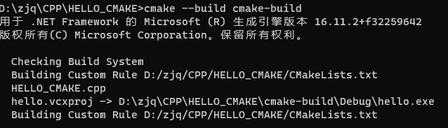

## CMake 构建项目

这里对了 [cmake笔记](cmake笔记) 中涉及的步骤进行了相对应的操作，以及对其的一些总结

以下的集成开发环境（IDE）为 **visual studio 2019**，从工程的创建和编译均使用该开发环境，

### 1.项目构成


```
|--.vs
|--.git
|--.gitignore
|--CMakeLists.txt
|--HELLO_CMAKE.sln
|--HELLO_CMAKE
  |--HELLO_CMAKE.cpp
  |-- ...(vs project files, such as .vcproj...)
```

如上述目录结构，该项目是一个普通的 vs 工程（IDE 为 visual studio），其中包含了普通的 sln 解决方案文件，以及一些 .vcproj 工程配置相关文件。

在上述目录中还添加了 CMakeLists.txt 文件，用于使用 CMake 进行项目构建。

```.gitignore
# ignore vs files
.vs/*
*.vcxproj
*.vcxproj*
*.sln

# ignore cmake build files and temp files
cmake-build/*
CMakeFiles/*
CMakeCache.txt
cmake_install.cmake
```

在上传项目时，需要忽略相关文件，这里忽略了 vs （IDE）的项目文件以及 cmake 构建后的文件 （**cmake-build**，后续会看到这个目录）。

主程序： **HELLO_CMAKE.cpp**

```C++
#include <iostream>

int main()
{
    std::cout << "Hello World!\n";
}
```

### 2.编写 CMakeLists.txt

```CMakeLists.txt
project(HELLO_CMAKE)

message(status "This is BINARY dir " ${HELLO_CMAKE_BINARY_DIR})

message(status "This is SOURCE dir "${HELLO_CMAKE_SOURCE_DIR})

add_executable(hello HELLO_CMAKE/HELLO_CMAKE.cpp)
```

### 3.构建命令

#### 生成 IDE 项目

<u>***这里特指生成 vs 解决方案***</u>

```cmd
HELLO_CMAKE>mkdir cmake-build
HELLO_CMAKE>cd cmake-build
cmake-build>cmake ..
```

当命令执行到这时，可以在 cmake-build 中发现 cmake 生成了一个 HELLO_CMAKE 的解决方案


打开该解决方案，可以看到有三个项目，分别是 **ALL_BUILD**、 **hello**、 **ZERO_CHECK** 三个工程


其中 ALL_BUILD 和 ZERO_CHECK 是 CMake 默认生成的；hello 在上述的 CMakeLists.txt 的 **add_executable** 配置的影响下生成的。

#### 直接构建项目

**执行完上述命令后，执行构建命令**

```CMD
cmake-build>cd ..
HELLO_CMAKE>cmake --build cmake-build
```



如上图，cmake 调用了 vs （本地编译环境）的编译器，编译了 HELLO_CMAKE 项目。生成在 cmake_build/Debug 目录下，是一个 hello.exe（和 **add_executable** 配置相关）。

运行程序：


正常运行。

