## CMake 构建项目

这里对了 [cmake笔记](cmake笔记) 中涉及的步骤进行了相对应的操作，以及对其的一些总结

以下的集成开发环境（IDE）为 **visual studio 2019**，从工程的创建和编译均使用该开发环境，

###  <span id="project_construction"> 1.项目构成 </span> 

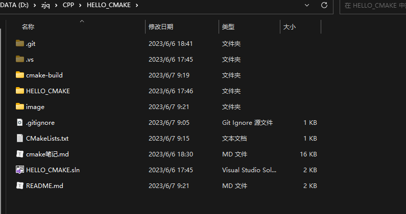

```
|--.vs
|--.git
|--.gitignore
|--CMakeLists.txt
|--HELLO_CMAKE.sln
|--HELLO_CMAKE
  |--HELLO_CMAKE.cpp
  |-- ...(vs project files, such as .vcproj...)
```

如上述目录结构，该项目是一个普通的 vs 工程（IDE 为 visual studio），其中包含了普通的 sln 解决方案文件，以及一些 .vcproj 工程配置相关文件。

在上述目录中还添加了 CMakeLists.txt 文件，用于使用 CMake 进行项目构建。

```.gitignore
# ignore vs files
.vs/*
*.vcxproj
*.vcxproj*
*.sln

# ignore cmake build files and temp files
cmake-build/*
CMakeFiles/*
CMakeCache.txt
cmake_install.cmake
```

在上传项目时，需要忽略相关文件，这里忽略了 vs （IDE）的项目文件以及 cmake 构建后的文件 （**cmake-build**，后续会看到这个目录）。

主程序： **HELLO_CMAKE.cpp**

```C++
#include <iostream>

int main()
{
    std::cout << "Hello World!\n";
}
```

### 2.编写 CMakeLists.txt

```cmake
project(HELLO_CMAKE)

message(status "This is BINARY dir " ${HELLO_CMAKE_BINARY_DIR})

message(status "This is SOURCE dir "${HELLO_CMAKE_SOURCE_DIR})

add_executable(hello HELLO_CMAKE/HELLO_CMAKE.cpp)
```

### 3.构建命令

#### 生成 IDE 项目

<u>***这里特指生成 vs 解决方案***</u>

```cmd
HELLO_CMAKE>mkdir cmake-build
HELLO_CMAKE>cd cmake-build
cmake-build>cmake ..
```

当命令执行到这时，可以在 cmake-build 中发现 cmake 生成了一个 HELLO_CMAKE 的解决方案

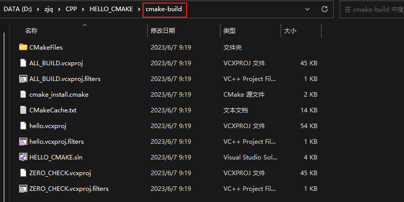

打开该解决方案，可以看到有三个项目，分别是 **ALL_BUILD**、 **hello**、 **ZERO_CHECK** 三个工程

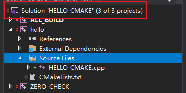

其中 ALL_BUILD 和 ZERO_CHECK 是 CMake 默认生成的；

> <u>**项目 hello** 在上述的 CMakeLists.txt 的 **add_executable** 配置的影响下生成的。</u>

#### 直接构建项目

**执行完上述命令后，执行构建命令**

```CMD
cmake-build>cd ..
HELLO_CMAKE>cmake --build cmake-build
```


如上图，cmake 调用了 vs （本地编译环境）的编译器，编译了 HELLO_CMAKE 项目。生成在 cmake_build/Debug 目录下，是一个 hello.exe（和 **add_executable** 配置相关）。

运行程序：

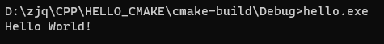

正常运行。

### 4.详细解释CMakeLists.txt

这是上述中 CMakeLists.txt 的内容

```cmake
project(HELLO_CMAKE)

message(status "This is BINARY dir " ${HELLO_CMAKE_BINARY_DIR})

message(status "This is SOURCE dir "${HELLO_CMAKE_SOURCE_DIR})

add_executable(hello HELLO_CMAKE/HELLO_CMAKE.cpp)
```

> 在这里直接对 [cmake笔记](cmake笔记) 进行引用

#### project关键字

> <u>***可以用来指定工程的名字和支持的语言，默认支持所有语言***</u>

**project**(HELLO_CMAKE)   指定了工程的名字，并且支持所有语言—建议

**project**(HELLO_CMAKE CXX)      指定了工程的名字，并且支持语言是C++

**project**(HELLO_CMAKE C CXX)      指定了工程的名字，并且支持语言是C和C++

该指定隐式定义了两个CMAKE的变量

**<projectname>_BINARY_DIR**，本例中是 **HELLO_CMAKE_BINARY_DIR**

**<projectname>_SOURCE_DIR**，本例中是 **HELLO_CMAKE_SOURCE_DIR**

MESSAGE关键字就可以直接使用者两个变量，当前都指向当前的工作目录，后面会讲外部编译

> **问题：如果改了工程名，这两个变量名也会改变**

解决：CMake中又定义<u>***两个预定义变量***</u>：**PROJECT_BINARY_DIR**和**PROJECT_SOURCE_DIR**，这两个变量和HELLO_CMAKE_BINARY_DIR，HELLO_CMAKE_SOURCE_DIR是一致的。所以改了工程名也没有关系

#### set关键字

> <u>***用来显示的指定变量的***</u>

（在本例中未使用，使用的是笔记中的例子）

**set**(SRC_LIST main.cpp)    SRC_LIST变量就包含了main.cpp

也可以 **set**(SRC_LIST main.cpp t1.cpp t2.cpp)

#### message关键字

> <u>***向终端输出用户自定义的信息***</u>

主要包含三种信息：

> - **send_error**，产生错误，生成过程被跳过。
> - **status**，输出前缀为—的信息。
> - **fatal_error**，立即终止所有 cmake 过程.
>

#### add_executable关键字

> <u>***生成可执行文件***</u>

**add_executable**(hello ${SRC_LIST})     <u>生成的可执行文件名是hello</u>，<u>源文件读取变量SRC_LIST中的内容</u>

也可以直接写 **add_executable**(hello HELLO_CMAKE.cpp)

上述例子可以简化的写成

```cmake
project(HELLO_CMAKE)
add_executable(hello HELLO_CMAKE.cpp)
```

**注意：工程名的 HELLO_CMAKE 和生成的可执行文件 hello 是没有任何关系的**

#### 语法注意事项

> - 变量使用**${}**方式取值，但是在 IF 控制语句中是直接使用变量名
>
> - **指令(参数 1 参数 2...)** 参数使用括弧括起，<u>***参数之间使用空格或分号分开。***</u> 以上面的 add_executable 指令为例，如果存在另外一个 func.cpp 源文件
>
>   就要写成：add_executable(hello main.cpp func.cpp)或者add_executable(hello main.cpp;func.cpp)
>
> - **指令是大小写无关的**，参数和变量是大小写相关的。

## 工程化 CMake 项目

同样使用了上述 vs 创建的 [解决方案结构](#project_construction)

**<u>在 HELLO_CMAKE 工程下创建 CMakeLists.txt</u>**

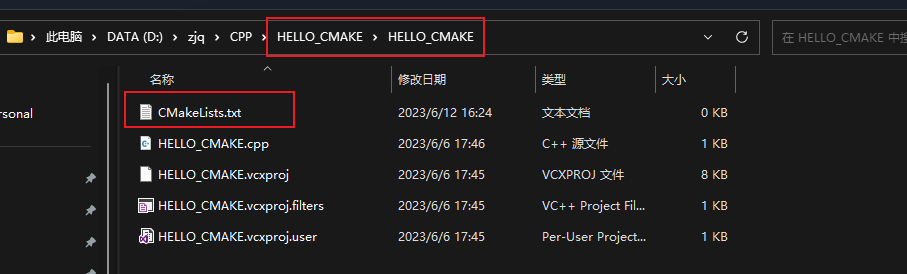

### 关联 CMakeLIsts

#### 项目下的总 CMakeLists：

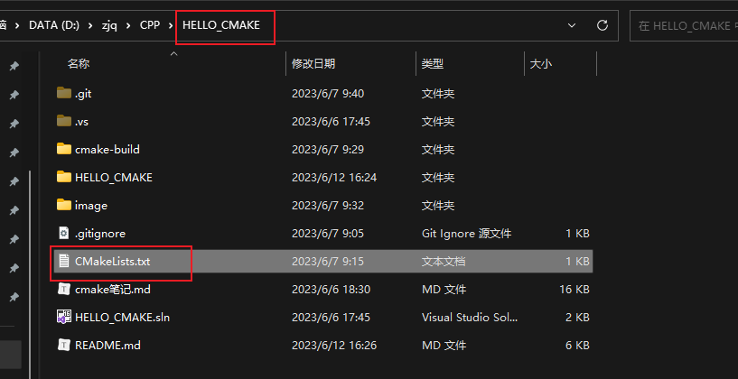

```CMAKE
project(HELLO_CMAKE)
add_subdirectory(HELLO_CMAKE bin)
```

##### add_subdirectory 指令

> add_subdirectory (source_dir [binary_dir] [EXCLUDE_FROM_ALL])
>
> - 这个指令用于**向当前工程添加存放源文件的子目录**，并可以指定**中间二进制**和**目标二进制存放**的位置
>
> - **EXCLUDE_FROM_ALL**函数是将写的目录从编译中排除，如程序中的example
>
> - ADD_SUBDIRECTORY(src bin)
>
>   将 src 子目录加入工程并**指定编译输出(包含编译中间结果)路径为bin 目录**
>
>   如果**不进行 bin 目录的指定**，那么编译结果(包括中间结果)都将**存放在build/src 目录**

#### 工程下的 CMakeLists

```CMake
add_executable(HELLO_CMAKE HELLO_CMAKE.cpp)
```

```
|--.vs
|--.git
|--.gitignore
|--CMakeLists.txt	#项目下的 CMakeLists
|--HELLO_CMAKE.sln
|--HELLO_CMAKE
  |--CMakeLists.txt	#工程下的 CMakeLists
  |--HELLO_CMAKE.cpp
  |-- ...(vs project files, such as .vcproj...)
```

### 进行项目生成

```CMD
HELLO_CMAKE>mkdir cmake-build && cd cmake-build
cmake-build>cmake ..
```

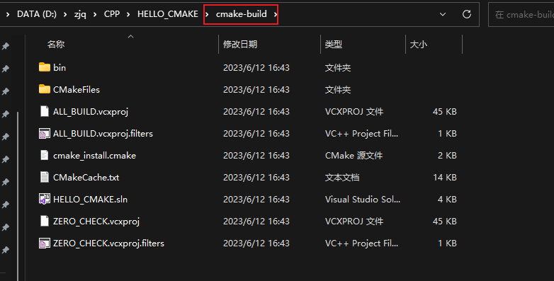

如上图，生成了一个以 **project** 参数中相同名称的解决方案名。

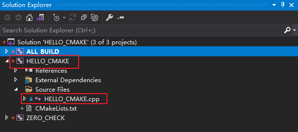

可以看到该项目下有一个以 **add_executable** 参数的 HELLO_CMAKE 工程，并且添加了 HELLO_CMAKE.cpp 源文件

### 构建

#### Debug

```CMD
HELLO_CMAKE>cmake --build cmake-build
```

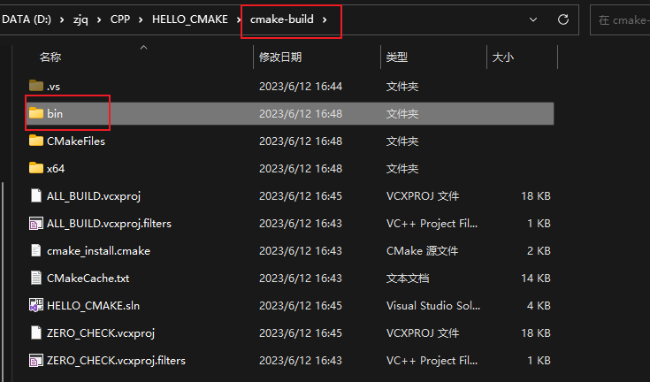

可以看到在 **cmake-build** 下**生成了一个 bin 目录**，这个目录在上述的 **add_subdirectory** 函数中的第二个参数有进行设置。

该目录存放了编译的 **中间文件** 和 **最终的编译结果**，以及最终的可执行文件，如下图（debug）编译。

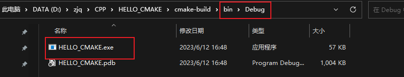

#### Release

```CMD
HELLO_CMAKE>cmake --build cmake-build --config Release
```

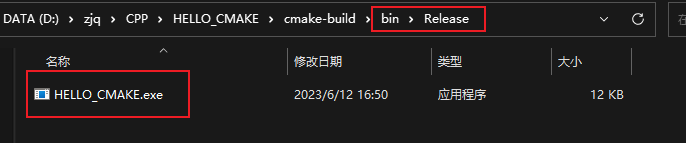

### 更改二进制保存路径参数

**set** 指令重新定义 **EXECUTABLE_OUTPUT_PATH** 和 **LIBRARY_OUTPUT_PATH** 变量 来指定最终的目标二进制的位置

```CMAKE
set(EXECUTABLE_OUTPUT_PATH ${PROJECT_BINARY_DIR}/bin)
set(LIBRARY_OUTPUT_PATH ${PROJECT_BINARY_DIR}/lib)
```

这一眼 👀 就能看出在**最外层**的 CMakeLists.txt 中进行设置

## 构建库 (dll / lib)

打开 IDE，添加工程 Library，用于编译库，同时编写 CMakeLists.txt，项目结构如下图：

 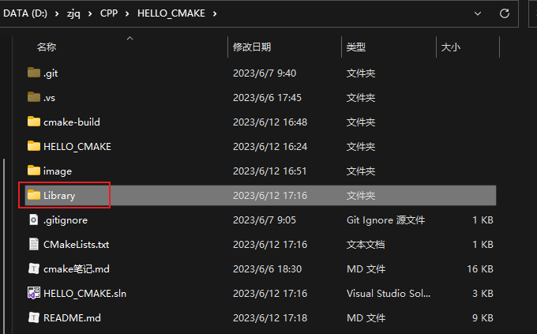

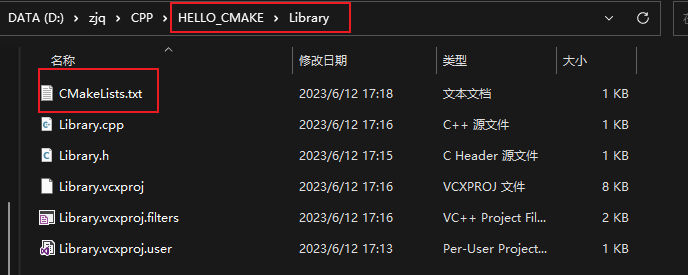

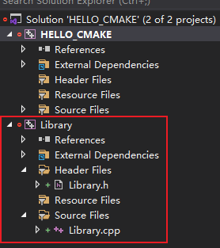

```c++
//Library.h

#ifndef __LIBRARY_H__
#define __LIBRARY_H__

#ifdef LIBRARY_EXPORT
#define LIBRARY_API __declspec(dllexport)
#else
#define LIBRARY_API __declspec(dllimport)
#endif // LIBRARY_EXPORT

void LIBRARY_API HelloLibrary();

#endif // !__LIBRARY_H__
```

```C++
//Library.cpp

#include <iostream>
#include "Library.h"

void HelloLibrary()
{
	std::cout << "Hello Library!" << std::endl;
}
```

#### 项目CMakeLists

```CMAKE
project(HELLO_CMAKE)
add_subdirectory(HELLO_CMAKE bin)

add_subdirectory(Library bin)
```

在原先的基础上**添加 Library 的源文件目录**

#### Library 工程 CMakeLIsts

```CMAKE
set(LIBRARY_SRC Library.cpp)
add_library(Library SHARED ${LIBRARY_SRC})
```

##### add_library 指令

> add_library (Library share ${LIBHELLO_SRC})
>
> - Library：就是正常的库名，生成的名字前面会加上lib，最终产生的文件是libhello.so
> - **SHARED**：动态库 ；   **STATIC**：静态库
>   - <u>***注意：必须要大写***</u>
> - ${LIBHELLO_SRC} ：**源文件**

#### 生成项目

这里指令就不写了，直接上截图：

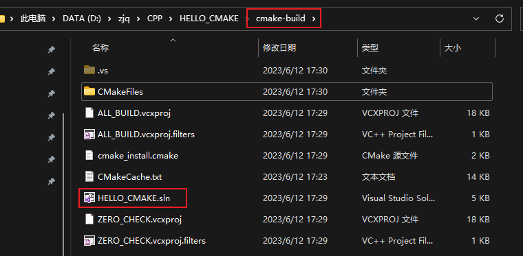

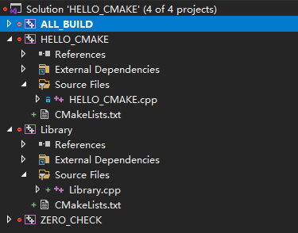

如上图，在 cmake-build 中生成了一个名为 HELLO_CMAKE 的解决方案，**该解决方案中包含了 HELLO_CMAKE 和 Library 两个工程**（add_executable add_library）

#### 构建项目

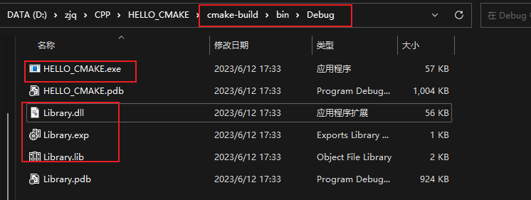

在 bin 目录下有构建好的 HELLO_CMAKE.exe 和 Library.dll 目标文件

## 安装 install

安装这一个步骤的目的，是为了将编译好的目标文件（或者其他文件）**归纳到某个指定的目录下**。

包括但不限于可执行文件、头文件、库文件。。。

这里以 Library 工程为例，**将其构建的构建结果作为第三方库进行安装**

### 项目

```CMAKE
set(CMAKE_INSTALL_PREFIX ../install)
```

插入上述指令，**CMAKE_INSTALL_PREFIX** 是 cmake 中自带的环境变量，是指定 install 的目录前缀，默认为系统的用户路径（c:/program files/....）。

这里设置为 **../install** ，即为**构建目录的上层的 install 路径**。

### Library

```CMAKE
#set(LIBRARY_SRC Library.cpp)

# 递归获取目录下所有的 cpp 文件
file(GLOB_RECURSE LIBRARY_SRC_FILES ./*.cpp)

# 递归获取目录下所有的h文件
file(GLOB_RECURSE LIBRARY_HEADER_FILES ./*.h)

#生成动态库和静态库
add_library(Library_shared SHARED ${LIBRARY_SRC_FILES})
#add_library(Library_static STATIC ${LIBRARY_SRC_FILES})

#将动态库和静态库的名字设置为 add
set_target_properties(Library_shared PROPERTIES OUTPUT_NAME "Library")
#set_target_properties(Library_static PROPERTIES OUTPUT_NAME "Library")

#设置动态库版本
set_target_properties(Library_shared PROPERTIES VERSION 1.0 SOVERSION 1)

#安装动态库和静态库
#INSTALL(TARGETS sub_lib_shared sub_lib_static
#    LIBRARY DESTINATION lib
#   ARCHIVE DESTINATION lib)

#安装动态库和静态库
INSTALL(TARGETS Library_shared
    LIBRARY DESTINATION ./lib)

#安装头文件
INSTALL(FILES ${LIBRARY_HEADER_FILES}  DESTINATION ./include)
```

如上述 CMakeLists，这份文件表示为该工程编译的是**动态库**（SHARED），通过 **INSTALL** 指令将文件进行输出和归纳

#### INSTALL 指令

```CMAKE
#二进制，静态库，动态库安装都用TARGETS
#ARCHIVE 特指静态库，LIBRARY 特指动态库，RUNTIME 特指可执行目标二进制。
INSTALL(TARGETS sub_lib_shared sub_lib_static
    LIBRARY DESTINATION lib
   ARCHIVE DESTINATION lib)

#文件放到该目录下
#若不设置 CMAKE_INSTALL_PREFIX, 那么安装路径则会进入系统的 user 目录下
INSTALL(FILES ${LIBRARY_HEADER_FILES}  DESTINATION ./include)
```

### 安装项目

```CMD
cmake-build>cmake --install ./ --config=Debug / 
```

## 分模块编译

### 项目目录结构

```
|--.vs
|--.git
|--.gitignore
|--CMakeLists.txt
|--HELLO_CMAKE.sln
|--HELLO_CMAKE
|  |--HELLO_CMAKE.cpp
|  |-- ...(vs project files, such as .vcproj...)
|
|--Library
|  |--Library.h
|  |--Library.cpp
|  |-- ...(vs project files, such as .vcproj...)
|
|--LinkLibrary
  |--LinkLibrary.cpp
```

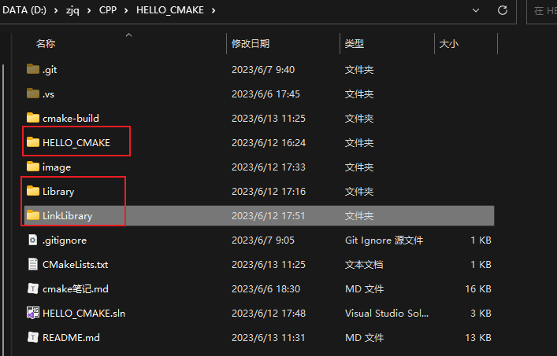

如上图和上述目录结构所示，新添加工程 **LinkLibrary**，该工程引用了 **Library** 的编译结果

#### Library

```CMAKE
#set(LIBRARY_SRC Library.cpp)

# 递归获取目录下所有的 cpp 文件
file(GLOB_RECURSE LIBRARY_SRC_FILES ./*.cpp)

# 递归获取目录下所有的h文件
file(GLOB_RECURSE LIBRARY_HEADER_FILES ./*.h)

#生成动态库和静态库
add_library(Library_shared SHARED ${LIBRARY_SRC_FILES})
#add_library(Library_static STATIC ${LIBRARY_SRC_FILES})

#将动态库和静态库的名字设置为 Library
set_target_properties(Library_shared PROPERTIES OUTPUT_NAME "Library")

#设置动态库版本
set_target_properties(Library_shared PROPERTIES VERSION 1.0 SOVERSION 1)
```

和之前相比，<u>***去掉了 INSTALL 部分***</u>，后续解释

#### LinkLibrary

```CMAKE
# 递归获取目录下所有的 cpp 文件
file(GLOB_RECURSE LINKLIBRARY_SRC_FILES ./*.cpp)

# 递归获取目录下所有的h文件
file(GLOB_RECURSE LINKLIBRARY_HEADER_FILES ./*.h)

set(LIBRARY_debug ${PROJECT_BINARY_DIR}/bin/Debug/Library)
set(LIBRARY_release ${PROJECT_BINARY_DIR}/bin/Release/Library)

include_directories(${PROJECT_SOURCE_DIR}/Library)

add_executable(LinkLibrary LINKLIBRARY_SRC_FILES)

target_link_libraries(LinkLibrary PRIVATE
			debug ${LIBRARY_debug}
			optimized ${LIBRARY_release})

#安装动态库和静态库
INSTALL(TARGETS Library_shared 
    LIBRARY DESTINATION ./lib)

#安装头文件
INSTALL(FILES ${LIBRARY_HEADER_FILES}  DESTINATION ./include)

INSTALL(TARGETS LinkLibrary
    RUNTIME DESTINATION ./bin)
```

##### include_directories指令

这条指令可以用来**向工程添加多个特定的头文件搜索路径**，路径之间用空格分割

在CMakeLists.txt中加入头文件搜索路径

##### target_link_libraries指令

> **link_directories**：添加非标准的共享库搜索路径
>
> **target_link_libraries**：添加需要链接的共享库

上面两条指令就像是：添加**库目录**、添加**链接器输入**

```CMAKE
target_link_libraries(LinkLibrary PRIVATE
			debug ${LIBRARY_debug}
			optimized ${LIBRARY_release})
```

在这里使用了 debug + optimized 来区分 debug 和 release 时应该使用哪个目录下的**库文件**

### 生成项目

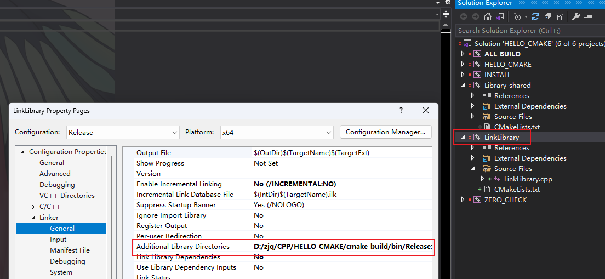

可与看到在 链接器这一项添加了而外的目录，input 里面也添加了

### 构建 and  安装

构建目录：

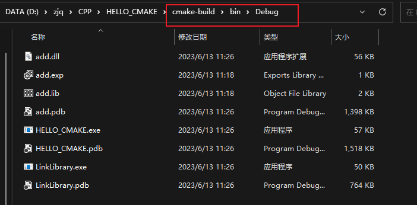

安装目录：

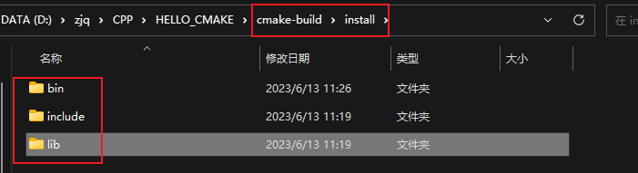